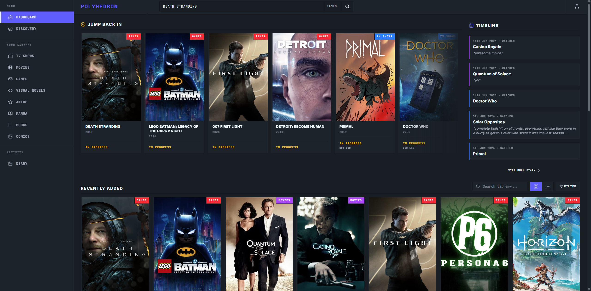
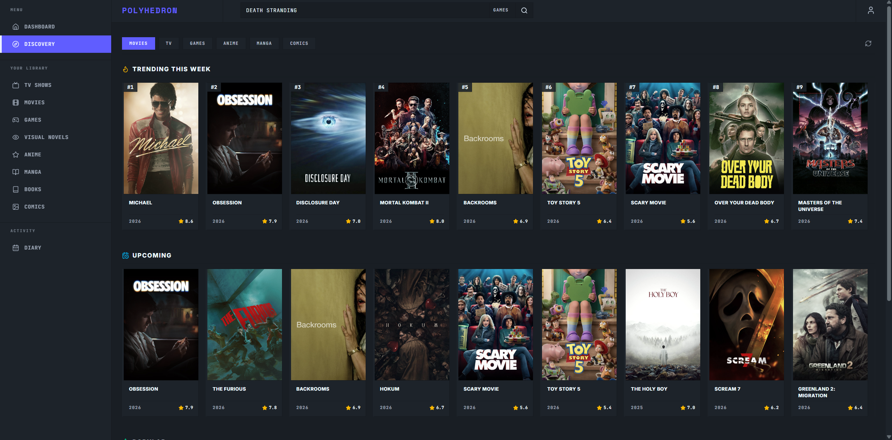
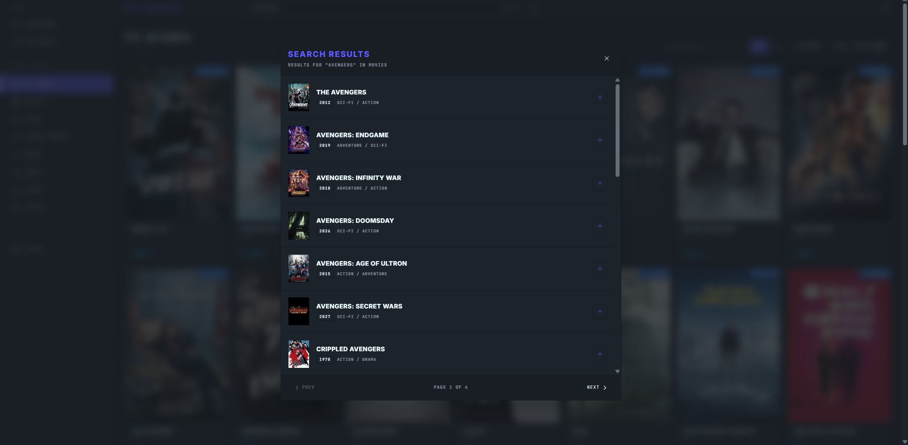
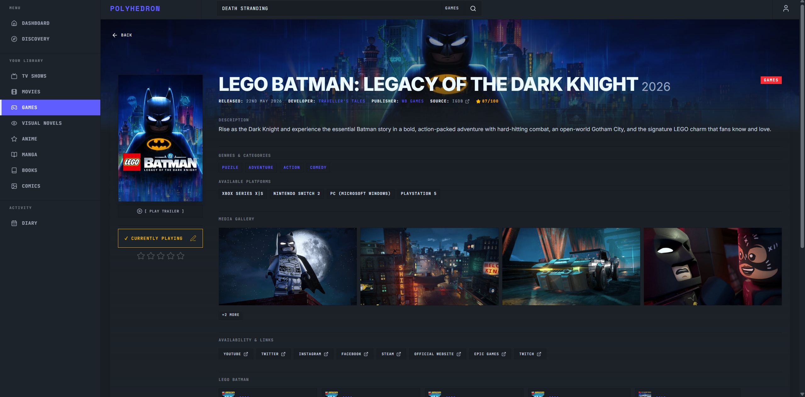
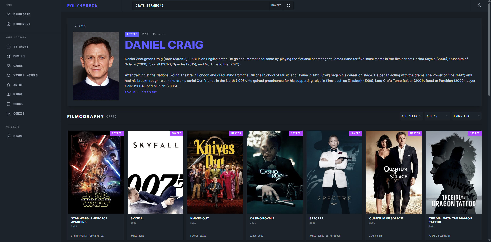
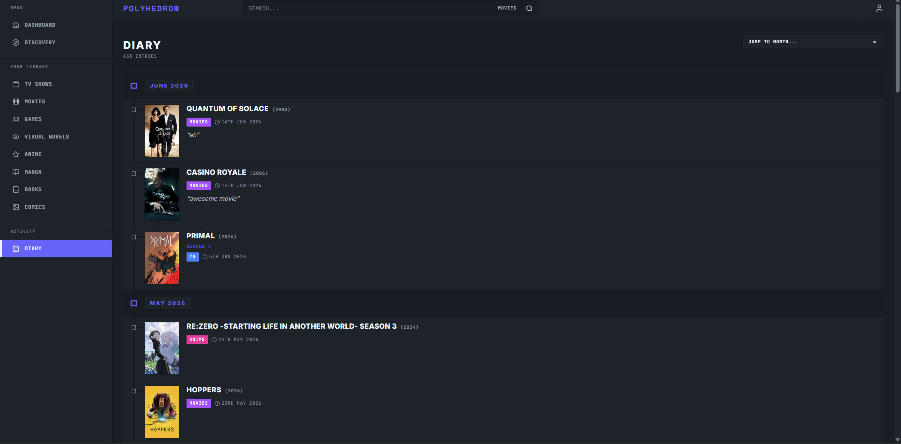

# Polyhedron

Polyhedron is a personal, universal media tracker for keeping movies, TV shows, anime, manga, books, visual novels, games, and comics in one library.

[Live application](https://project-polyhedron.netlify.app/) · [GitHub repository](https://github.com/devchuks/polyhedron-media-tracker)



## Features

- Track planned, in-progress, completed, and dropped media across eight categories.
- Record ratings, progress, start and completion dates, rewatch/reread activity, reviews, and diary notes.
- Follow TV episode progress and create explicit season diary entries without conflating season history with whole-series state.
- Track comic issues individually, including partial issue lists and completion state.
- Browse a unified Dashboard, filterable category libraries, and a chronological Diary.
- Search providers, explore trending and upcoming media, inspect detailed metadata, and follow creators, studios, publishers, and related works.
- Sync authenticated libraries through Supabase Auth, PostgreSQL, row-level security, RPCs, tombstones, and Realtime.
- Try a curated local library in Guest Mode. Guest data is stored in IndexedDB and remains separate from authenticated accounts.
- Export and restore current or supported legacy backups.
- Log supported activity through an authenticated Telegram webhook integration.

## Discover and search

Discovery brings together trending, upcoming, and popular media from the supported providers.



Global search works across every media category and supports paginated results with quick-add actions.



## Rich media details and exploration

Detail pages combine artwork, descriptions, scores, genres, release information, people and companies, galleries, external links, recommendations, and category-specific metadata where the provider supplies it.



Explore pages connect media to creators, cast, studios, publishers, developers, genres, and filmographies.



## Diary

The Diary groups explicit activities by date. Entries have stable identities, so separate same-day activities can coexist and individual reviews, ratings, actions, dates, and TV season metadata can be edited without overwriting sibling entries.



## Media providers

| Category | Provider |
|---|---|
| Movies and TV | TMDB |
| Anime and manga | AniList |
| Games | IGDB |
| Books | Open Library |
| Visual novels | VNDB |
| Comics and issues | Metron |

TMDB, IGDB, Metron, and VNDB operations are routed through bounded Supabase Edge Functions where the application needs authenticated proxying or server-side credentials. AniList and Open Library use their public APIs.

## Tech stack

- React 19, React Router, Vite
- Tailwind CSS 4 and DaisyUI
- Zustand state management
- IndexedDB guest persistence
- Supabase Auth, PostgreSQL, Realtime, Edge Functions, and row-level security
- Netlify hosting

## Local setup

Requirements: a current Node.js/npm installation and a Supabase project with the repository migrations applied.

```sh
git clone https://github.com/devchuks/polyhedron-media-tracker.git
cd polyhedron-media-tracker
npm ci
cp .env.example .env.local
npm run dev
```

The browser requires these public configuration names:

```text
VITE_SUPABASE_URL
VITE_SUPABASE_ANON_KEY
```

The Edge Functions use these server-side secret names as applicable. Keep them in the Supabase secret manager, never in `VITE_` variables or committed files:

```text
TMDB_API_KEY
TWITCH_CLIENT_ID
TWITCH_CLIENT_SECRET
METRON_USERNAME
METRON_PASSWORD
TELEGRAM_BOT_TOKEN
TELEGRAM_CHAT_ID
TELEGRAM_WEBHOOK_SECRET
GEMINI_API_KEY
ADMIN_USER_ID
SUPABASE_URL
SUPABASE_SERVICE_ROLE_KEY
SUPABASE_ANON_KEY
```

## Commands

```sh
npm run dev          # local development
npm test             # Node test suite
npm run lint         # ESLint
npm run build        # production build
npm run preview      # preview the production build
```

The project also defines `npm run dev:staging` and `npm run build:staging` for explicitly configured staging environments.
